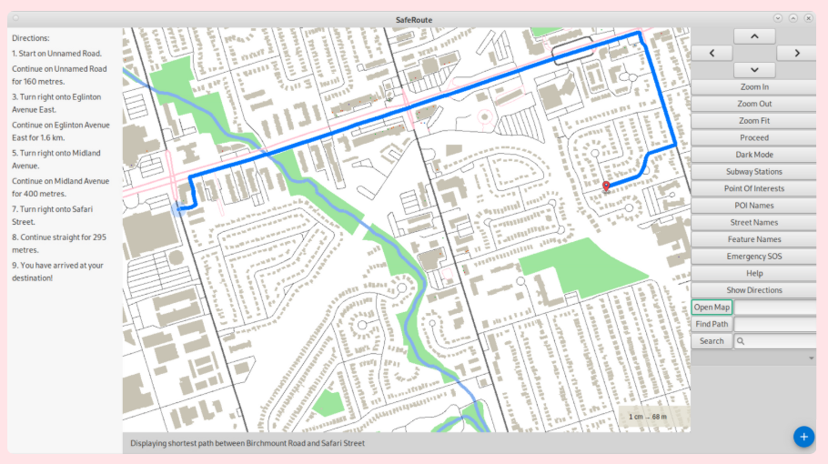

# SafeRoute

SafeRoute is a **real-time, safety-first navigation system** built with **C++**, **OpenStreetMap data**, and a custom rendering pipeline.  
It combines advanced GIS techniques with intelligent optimization, delivering both safety-oriented features and high-performance routing.

---

## 🔑 Core Features

### Safety and Usability
- **SOS Location Sharing**: integrated with Gmail SMTP to simulate real-time emergency alerts.  
- **POI Reviews and Ratings**: instant popovers show coordinates, ratings, and top reviews without page reloads.  
- **Customizable Map UI**: dark mode, feature toggles, and clutter reduction for an intuitive navigation experience.  

### Advanced Routing
- **Shortest Path Algorithms**
  - **Dijkstra’s Algorithm**: guaranteed optimal paths.  
  - **A\* Search**: heuristic-driven search for faster convergence.  
  - **Multi-Dijkstra**: extended to compute paths across multiple start/end points.  

- **Traveling Courier Problem (multi-stop optimization)**
  - **Greedy Heuristic**: quick baseline path generation.  
  - **2-opt / 3-opt**: iterative edge reordering for local improvements.  
  - **Simulated Annealing**: stochastic global search to escape local minima.  
  - **Parallelism**: multi-threaded execution reduced runtime by ~90%, scaling to complex problem sizes efficiently.  

---

## ⚡ Performance Achievements
- Achieved **<60 ms load times** on maps with **10,000+ intersections**.  
- Routing engine consistently met real-time interaction benchmarks (<100 ms input response, smooth pan/zoom).  
- Ranked **top 30% (22/71)** in routing optimization against competing teams.  

---
## 📺 Demo

*Includes feature walk-throughs, routing visualizations, and algorithm animations.*

